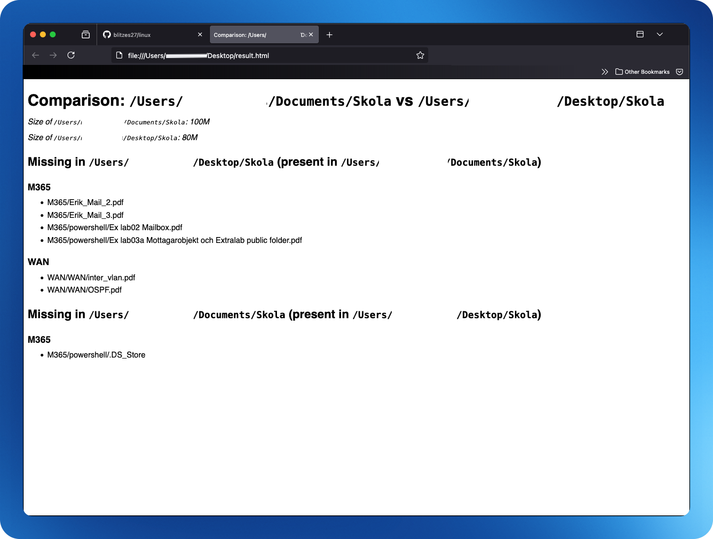

# Directory compare

This script compares all the files in two directories and list the differences like the image below on a HTML page.



```bash
# YOUR VARIABLES HERE
FOLDER1="$HOME/ENTER PATH"
FOLDER2="$HOME/ENTER PATH"
HTML_RESULT="$HOME/result.html"
GITHUB="https://raw.githubusercontent.com/blitzes27/linux/main"

# Runs the script from github
curl -fsSL "$GITHUB/compare_directory/compare_dir.sh" | bash \
-s -- "$FOLDER1" "$FOLDER2" "$HTML_RESULT"
```