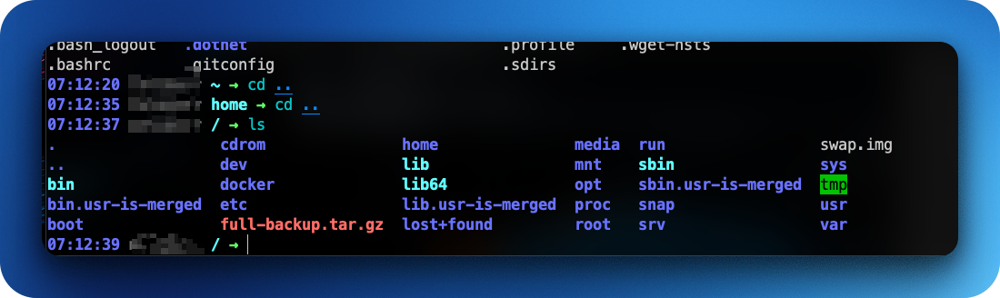

# Terminal Styling #

Your terminal will look amazing and it works in SSH sessions.

Custom Oh My Bash configuration with:

	•	Fast, interactive prompt via Oh My Bash (theme:  font)

	•	Intelligent auto‑completion for Git, Composer, SSH, and more

	•	Command correction (misspelled commands are auto‑fixed)

	•	Directory jumping with zoxide (z alias)

	•	Enhanced cat output using batcat

	•	Git shortcuts & bashmarks plugin for marking favorite directories

	•	Optional case‑/hyphen‑sensitive completion settings

	•	Asynchronous shell editing (BLE) for a smoother experience

	•	Custom aliases (ls, ls1, etc.) and plugin loading

	•	Configurable update checks, colors, titles, history timestamps, etc.

	
# Install commands can be viewed on Notion site below #

## https://peaceful-yard-05b.notion.site/Bash-git-1dc0af5faea58053b10fe0aeb56a539f?pvs=4 ##

## To auto install the plastic operation of your bash shell please run ##

<pre>
cd ~ && bash -c "$(curl -fsSL https://raw.githubusercontent.com/blitzes27/linux/main/interior_terminal_decoration/auto_install.sh)"
</pre>
